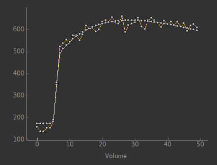

Fabber models for DCE-MRI
=========================

These models use the `Fabber <https://fabber-core.readthedocs.io/>`_
Bayesian model fitting framework [1]_ to implement a number of models
for Dynamic Contrast Enhanced MRI (DCE-MRI).

Getting FABBER_DCE
------------------

The DCE models are not currently included as part of 
`FSL <https://fsl.fmrib.ox.ac.uk/fsl/>`_. To get the models
you will either need to 
`build from source <https://fabber-core.readthedocs.io/en/latest/building.html#building-new-or-updated-model-libraries>`_ 
using an existing FSL 6.0.1 or later installation, or download 
the pre-built `Fabber bundle <https://fabber-core.readthedocs.io/en/latest/getting.html#standalone-fabber-distribution>`_ 
which contains the latest DCE release alongside
other models in a standalone package.

Models included
---------------

Currently four models are included in the maintained release:

The standard and extended one-compartment Tofts model [2]_
~~~~~~~~~~~~~~~~~~~~~~~~~~~~~~~~~~~~~~~~~~~~~~~~~~~~~~~~~~

This model is selected using ``--model=dce_tofts``. Options are:

--ktrans        Initial and prior Ktrans value
--ve            Initial and prior Ve value
--kep           If using ``--infer-kep``, initial and prior Kep value
--vp            If using ``--infer-vp``, initial and prior Vp value
--infer-vp      Infer the additional Vp parameter (i.e. use the Extended
                Tofts model)
--infer-kep     Infer Kep instead of Ve - the two are related by Kep = Ktrans / Ve.
                Often inferring Kep enables a better
                fit to be found however the resulting derived values of Ve
                may be greater than 100%. This may reflect an innaccurate
                T10 value.
--force-conv    Force numerical solution of the convolution equation even when
                an analytic solution exists. Currently an analytic solution is
                only possible when using ``--aif=orton``
                
The two-compartment exchange model [3]_
~~~~~~~~~~~~~~~~~~~~~~~~~~~~~~~~~~~~~~~

This model is selected using ``--model=dce_2CXM``. Options are:

--fp            Initial and prior flow in min-1 (default 0.3)
--ps            Initial and prior permeability surface area product in min-1 (default 0.3)
--vp            Initial and prior plasma volume in decimal between zero and one (default 0.3)
--ve            Initial and prior extracellular space volume in decimal between zero and one (default 0.3)
--conv-method   Method to compute convolution, trapezium, matrix or iterative. Default is iterative

The Compartmental Tissue Uptake model [4]_
~~~~~~~~~~~~~~~~~~~~~~~~~~~~~~~~~~~~~~~~~~

This model is selected using ``--model=dce_CTU``. Options are:

--fp            Initial and prior flow in min-1 (default 0.3)
--ps            Initial and prior permeability surface area product in min-1 (default 0.3)
--vp            Initial and prior plasma volume in decimal between zero and one (default 0.3)
--conv-method   Method to compute convolution, trapezium, matrix or iterative. Default is trapezium

The Adiabatic Approximation to the Tissue Homogeniety model [5]_
~~~~~~~~~~~~~~~~~~~~~~~~~~~~~~~~~~~~~~~~~~~~~~~~~~~~~~~~~~~~~~~~

This model is selected using ``--model=dce_AATH``. Options are:

--fp            Initial and prior flow in min-1 (default 0.3)
--ps            Initial and prior permeability surface area product in min-1 (default 0.3)
--vp            Initial and prior plasma volume in decimal between zero and one (default 0.3)
--ve            Initial and prior extracellular space volume in decimal between zero and one (default 0.3)

Generic options common to all models
------------------------------------

Acquisition parameters
~~~~~~~~~~~~~~~~~~~~~~

--delt      Time resolution between volumes, in minutes
--fa        Flip angle in degrees.
--tr        Repetition time (TR) In seconds.
--r1        Relaxivity of contrast agent, In s^-1 mM^-1.

Optional parameters
~~~~~~~~~~~~~~~~~~~

The following model parameters can be specified as options, however they can
also be inferred as part of the fitting process. If they are inferred the
specified value is used as an initial value and also as the prior value.

--t10           Baseline T1 value in seconds. May be inferred.
--sig0          Fully relaxed baseline signal. May be inferred.
--delay         Injection time (or delay time when using measured AIF) in minutes. May be inferred.
--infer-t10     Infer t10 value
--infer-sig0    Infer baseline signal
--infer-delay   Infer the delay parameter

It is quite common to measure a T10 map independently (e.g. using VFA images or
a saturation recovery sequence). In this case you can use ``--infer-t10`` and
add an *image prior* for the T10 value. See the examples below for how to do this.

AIF specification
~~~~~~~~~~~~~~~~~

The arterial input function (AIF) is a critical piece of information used in performing 
blood-borne tracer modelling, as in DCE and other types of MRI. The AIF can either be
specified as a series of values in a text file or a generic 'population' AIF can be used.

If the AIF is suppplied as a signal-curve ``--aif=signal`` it will be converted to a 
concentration-time curve using the supplied haematocrit and T1b values ``--aif-hct``
and ``--aif-t1b``.

If using the Orton AIF [6]_ the parameters may be varied using the options described below. The
defaults are those given in the Orton paper. The Parker AIF [7]_ uses hardcoded parameter values
from the paper.

--aif       Source of AIF function: orton=Orton (2008) population AIF, parker=Parker (2006) population AIF, signal=User-supplied vascular signal, conc=User-supplied concentration curve
--aif-file  File containing single-column ASCII data defining the AIF. For aif=signal, this is the vascular signal curve. For aif=conc, it should be the blood plasma concentration curve
--aif-hct   Haematocrit value to use when converting an AIF signal to concentration. Used when aif=sig
--aif-t1b   Blood T1 value to use when converting an AIF signal to concentration. Used when aif=sig
--aif-ab    aB parameter for Orton AIF in mM. Used when aif=orton
--aif-ag    aG parameter for Orton AIF in min^-1. Used when aif=orton
--aif-mub   MuB parameter for Orton AIF in min^-1. Used when aif=orton
--aif-mug   MuG parameter for Orton AIF in min^-1. Used when aif=orton

Other options
~~~~~~~~~~~~~

--auto-init-delay   Automatically initialize posterior value of delay parameter by fitting a step function
                    to the DCE timeseries.

Examples
--------

Tofts model on DCE data collected every 6s using the Orton population AIF::

    fabber_dce --data=dce_data --mask=roi_img 
               --method=vb --noise=white 
               --delt=0.1 --fa=15 --tr=0.0027 --r1=3.7 --delay=0.5
               --aif=orton 
               --infer-delay --infer-sig0 --infer-t10 
               --convergence=trialmode --max-trials=20
               --output=dce_output --overwrite --save-model-fit

As above but using a pre-measured T10 map::

    fabber_dce --data=dce_data --mask=roi_img 
               --method=vb --noise=white 
               --delt=0.1 --fa=15 --tr=0.0027 --r1=3.7 --delay=0.5
               --aif=orton 
               --infer-delay --infer-sig0 --infer-t10 
               --PSP_byname1=t10 --PSP_byname1_type=I --PSP_byname1_image=T10_map
               --convergence=trialmode --max-trials=20
               --output=dce_output_with_t10_map --overwrite --save-model-fit

References
----------

.. [1] *Chappell, M.A., Groves, A.R., Woolrich, M.W., "Variational Bayesian
   inference for a non-linear forward model", IEEE Trans. Sig. Proc., 2009,
   57(1), 223–236.*

.. [2] http://www.paul-tofts-phd.org.uk/DCE-MRI_siemens.pdf

.. [3] https://onlinelibrary.wiley.com/doi/full/10.1002/mrm.25991

.. [4] https://onlinelibrary.wiley.com/doi/full/10.1002/mrm.26324

.. [5] https://journals.sagepub.com/doi/10.1097/00004647-199812000-00011

.. [6] `Matthew R Orton et al 2008 Phys. Med. Biol. 53 1225 <https://iopscience.iop.org/article/10.1088/0031-9155/53/5/005/meta>`_

.. [7] https://onlinelibrary.wiley.com/doi/full/10.1002/mrm.21066